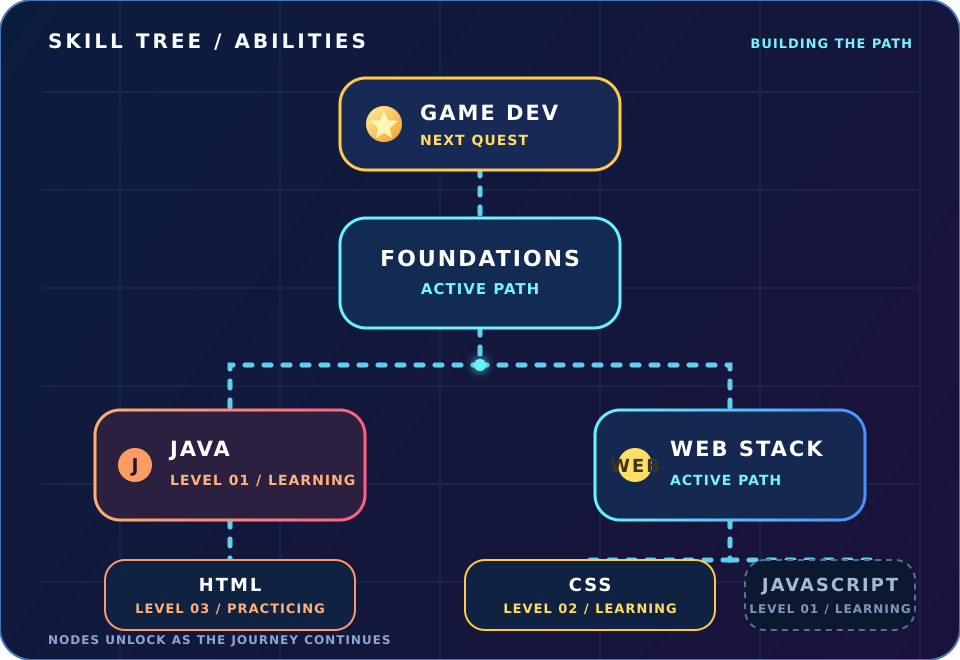
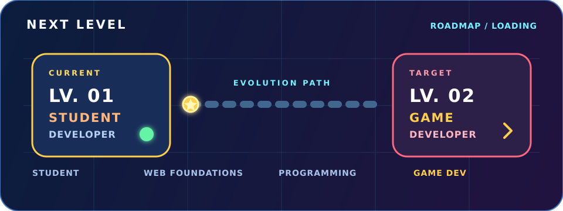

  

 

## > PLAYER PROFILE

Eu sou o **Giovanni**, aluno da **ETEC pelo programa AMS** e desenvolvedor em formação. Estou construindo minha base em desenvolvimento web com **HTML e CSS**, evoluindo em **Java e JavaScript** e explorando o caminho até o **desenvolvimento de jogos**.

> **Status:** aprendendo construindo. Cada projeto é uma nova partida; cada habilidade desbloqueada abre o próximo caminho.

## > SKILL TREE

  

## > LOADOUT

  

## > CURRENT QUESTS

  

## > NEXT LEVEL

  

## > PLAYER STATS

  
  
  

 

  Developer Arena / ETEC / AMS / Building the skill tree, one level at a time.

<!-- README de perfil personalizado para dionaker. -->

